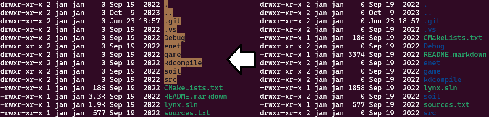

Jan Zwiener's dotfiles
======================

Just my private repository of typical config settings.

    source 00.txt

Fix dark blue folders
---------------------

Adding to `.bashrc`:

    export LS_COLORS="$LS_COLORS:di=30;43"

With `di` stands for directory `30;43` are the ANSI color codes for black text (`30`) and an orange (`43`) background.
I don't know why folders are by default dark blue, which is hard to read, e.g. on a laptop outdoors on a sunny day. The new settings are on the left of the following image, the Ubuntu defaults on the right:

Defaults for ls command
-----------------------

Adding to `.bashrc`:

    alias ls='ls --color=auto --group-directories-first --human-readable'

This includes better defaults for `ls` (group folders first, see screenshot above) and use human readable file sizes: e.g. `26M` instead of `27035267` bytes.

Show current git branch in prompt
---------------------------------

Show the current active git branch and indicate if it has been modified (`GIT_PS1_SHOWDIRTYSTATE`). Also don't use cyan instead of dark blue for the current folder for better readability:

Adding to `.bashrc`:

    GIT_PS1_SHOWDIRTYSTATE=1
    RESET="\[\017\]"
    NORMAL="\[\033[0m\]"
    GREEN="\[\033[32;1m\]"
    PURPLE="\[\033[35;1m\]"
    CYAN="\[\033[36;1m\]"
    export PS1="${RESET}${GREEN}\u@\h${NORMAL}:${CYAN}\w${PURPLE}\$(__git_ps1)${NORMAL}\$ "

Better bash history
-------------------

Using the better bash history settings from [Tom Ryder](https://blog.sanctum.geek.nz/better-bash-history/)

  * Store history immediately with `history -a`
  * Store an entire multiline command as a single entry (not as separate entry) `shopt -s cmdhist`
  * Don't save commands like `ls` to history
  * Longer history file
  * Don't store repeated commands (only most recent one), ignore commands start start with a space
  * Append instead of rewrite/overwrite `shopt -s histappend`

Adding to `.bashrc`:

    PROMPT_COMMAND='history -a'
    shopt -s cmdhist
    export HISTIGNORE="&:[ ]*:exit:ls:ll:bg:fg:history"
    HISTTIMEFORMAT='%F %T '
    HISTSIZE=500000
    HISTFILESIZE=100000
    HISTCONTROL="erasedups:ignoreboth"
    shopt -s histappend

grep defaults
-------------

By default grep is searching also in git repositories and tags files, which typically is not what I want.
So adding an alias for `grep` to exclude `.git` directories and `tags` files in `.bashrc`:

    alias grep='grep --color=auto --exclude-dir=".git" --exclude=tags'

Setting workspace switching shortcuts to match Windows style
------------------------------------------------------------

Use `Ctrl + Win + Left` or `Ctrl + Win + Right` to switch between virtual desktops:

    gsettings set org.gnome.desktop.wm.keybindings switch-to-workspace-left "['<Control><Super>Left']"
    gsettings set org.gnome.desktop.wm.keybindings switch-to-workspace-right "['<Control><Super>Right']"

Move and resize Gnome windows with the Alt key
----------------------------------------------

Press `Alt` and left click to move a window or right click to resize it:

    gsettings set org.gnome.desktop.wm.preferences mouse-button-modifier '<Alt>'
    gsettings set org.gnome.desktop.wm.preferences resize-with-right-button true

Other
-----

Minor things like `ctrl-s` should not freeze the terminal and somewhat more sane bash behavior (set in `.inputrc`):

    stty -ixon
    set completion-ignore-case On
    set show-all-if-ambiguous On
    set bell-style none

